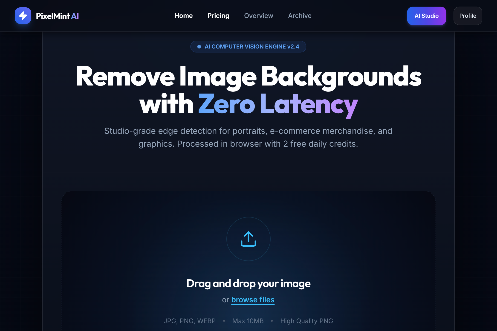
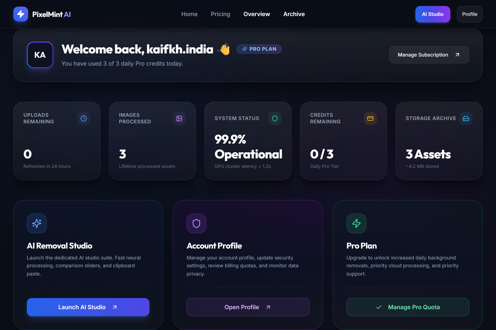
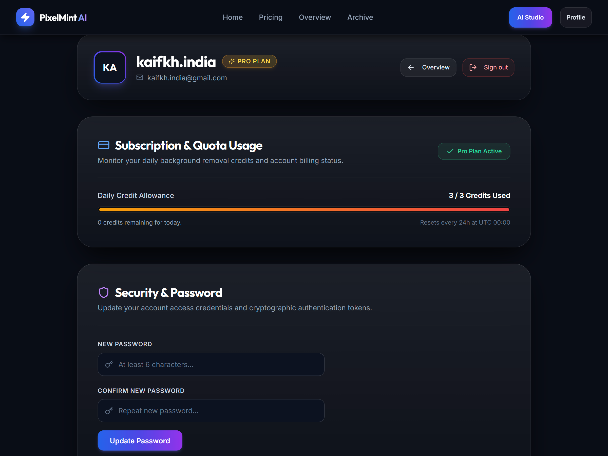
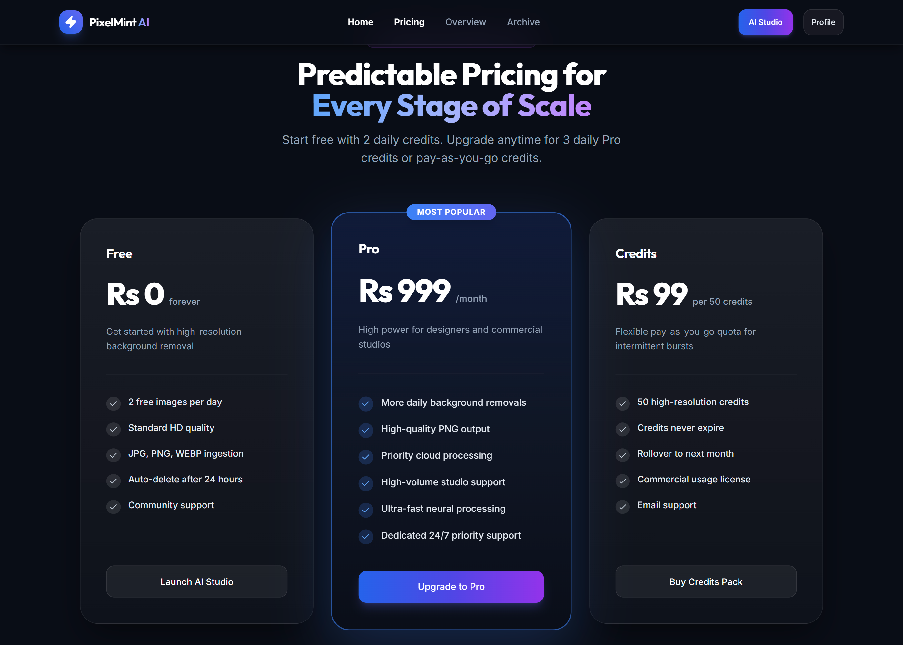
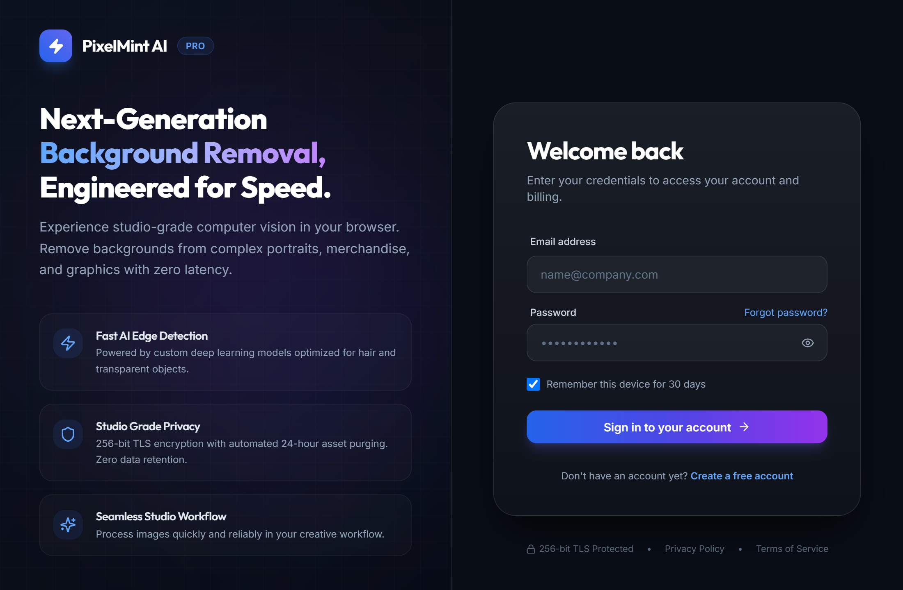
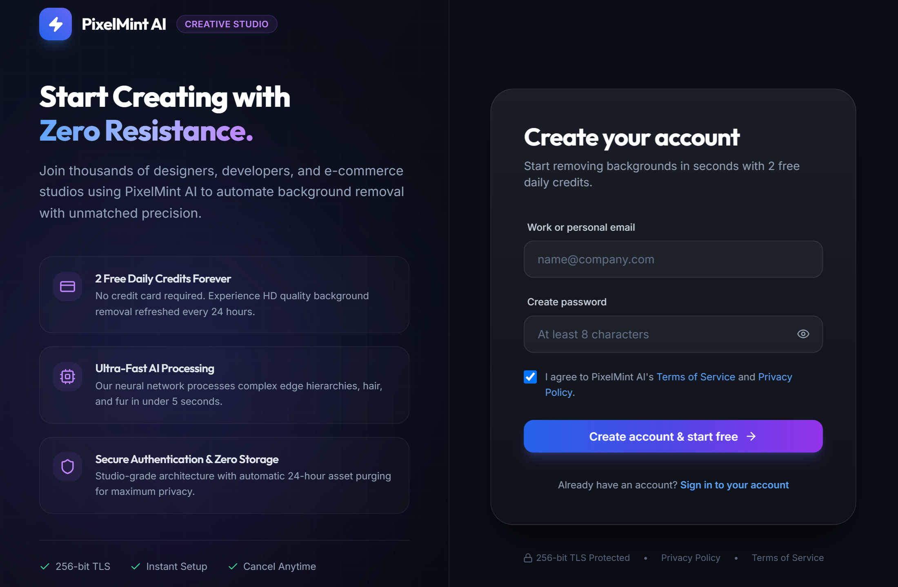
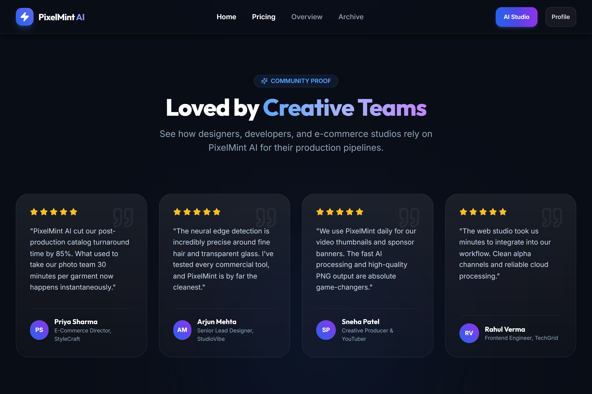
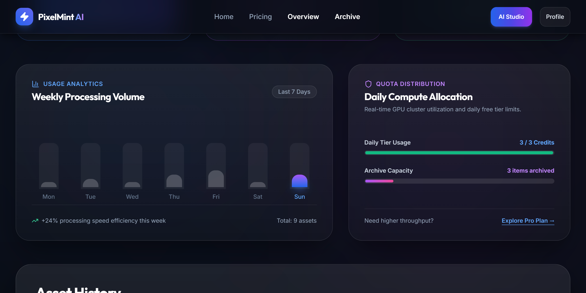
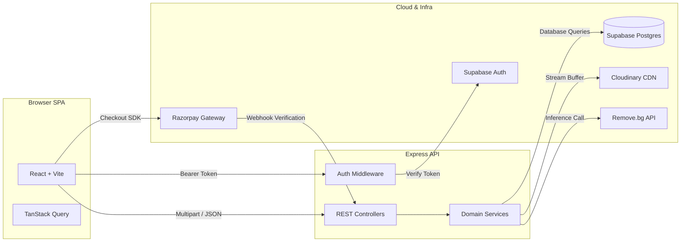

<div align="center">

# PixelMint AI

**Full-stack web application for automated image background removal, featuring tiered subscription billing and usage quota management.**

[](https://react.dev)
[](https://www.typescriptlang.org)
[](https://nodejs.org)
[](https://vitejs.dev)
[](https://supabase.com)
[](https://razorpay.com)
[](https://cloudinary.com)
[](#license)

<br />

[Live Demo](#-live-demo) • [Why PixelMint AI?](#-why-pixelmint-ai) • [Features](#-features) • [Screenshots](#-screenshots) • [Architecture](#-architecture) • [Getting Started](#-getting-started) • [API Overview](#-api-overview)

</div>

---

## 🌍 Live Demo

| Platform | URL | Description |
| :--- | :--- | :--- |
| **Frontend Application** | https://pixelmint-ai-frontend.vercel.app/ | Interactive Studio & Dashboard |
| **Backend REST API** | https://pixelmint-ai-xo8g.onrender.com | Express REST API |
| **GitHub Repository** | https://github.com/kaifcs/PixelMint_AI | Source Code |

---

## 🌟 Why PixelMint AI?

PixelMint AI is a full-stack SaaS application that enables users to remove image backgrounds using AI. It provides secure authentication, image processing, subscription management, and a responsive dashboard for managing processed images and account usage.

This project was built to strengthen my full-stack development skills using React, TypeScript, Express, Supabase, and cloud services.

---

## ✨ Features

- 🎨 **AI Background Removal** – Upload images via drag-and-drop or clipboard paste (`Ctrl+V` / `Cmd+V`) and remove backgrounds instantly with an interactive before/after comparison slider.
- 🔐 **Authentication** – Secure sign up, login, and session management using Supabase Auth.
- 📊 **Dashboard** – Track image processing history and daily usage.
- 🕘 **Processing History** – View recently processed image cutouts and redownload them anytime.
- 💳 **Razorpay Payments** – Upgrade to Pro tier with secure payment checkout and webhook verification.
- 👤 **User Profile** – Manage account details, update passwords, and view current subscription status.
- 📱 **Responsive Design** – Smooth interface built with Tailwind CSS and Radix UI across desktop and mobile devices.

---

## 📸 Screenshots

### 🏠 Home



### 🏠 Home (Alternative)


### 📊 Dashboard



### 👤 Profile



### 💳 Pricing



### 🔐 Login



### 📝 Signup



### ℹ️ About


### 💬 Contact


### ⭐ Feedback



### 🕘 History



---

## 💻 Tech Stack

| Layer | Technologies | Description |
| :--- | :--- | :--- |
| **Frontend** | React, Vite, React Router | Single-page application with fast client routing |
| **Styling & UI** | Tailwind CSS, Radix UI, Lucide Icons | Utility-first styling and accessible components |
| **State & Forms** | TanStack Query, React Hook Form, Zod | Data caching and form validation |
| **Backend** | Node.js, Express, TypeScript | REST API server with automated error handling |
| **Database & Auth** | Supabase PostgreSQL, Supabase Auth | Relational database and user authentication |
| **Cloud Integration** | Cloudinary SDK, Remove.bg API, Razorpay SDK | Media storage, AI background removal, and payment gateways |
| **Quality & Tools** | Vitest, ESLint, dotenv | Unit testing, code linting, and environment configuration |

---

## 🏗️ Architecture



---

## 🗂️ Folder Structure

```
PixelMint_AI/
├── backend/
│   ├── src/
│   │   ├── config/          # Environment variables and cloud SDK clients
│   │   ├── controllers/     # Route handlers (image, payment, user, contact)
│   │   ├── jobs/            # Daily scheduler for asset cleanup
│   │   ├── middlewares/     # Auth verification and rate limiting
│   │   ├── routes/          # Express API router definitions
│   │   ├── services/        # Business logic (removeBg, payment, usage, history)
│   │   └── utils/           # Custom logger and error utilities
│   └── supabase/
│       ├── schema.sql       # PostgreSQL table schemas
│       └── migrations/      # Database policies and functions
├── frontend/
│   ├── src/
│   │   ├── app/             # Query providers, router, and error boundary
│   │   ├── components/      # Navbar, footer, and UI primitives
│   │   ├── features/        # Auth context, upload hooks, and billing logic
│   │   ├── pages/           # Route views (Dashboard, Workspace, Pricing, etc.)
│   │   ├── services/        # Typed API client and Supabase singleton
│   │   └── test/            # Vitest unit testing suite
│   ├── vercel.json          # SPA route rewrite rules
│   └── vite.config.ts       # Vite bundler configuration
└── package.json             # Root monorepo workspace scripts
```

---

## 🚀 Getting Started

### Prerequisites

- **Node.js**: v18+ and **npm** v9+
- **Cloud Accounts**: [Supabase](https://supabase.com), [Cloudinary](https://cloudinary.com), [Razorpay](https://razorpay.com), and [Remove.bg](https://www.remove.bg/api)

### 1. Clone & Install

```bash
git clone https://github.com/kaifcs/PixelMint_AI.git
cd PixelMint_AI

# Install backend dependencies
cd backend && npm install

# Install frontend dependencies
cd ../frontend && npm install
```

### 2. Configure Environment Variables

Copy the example `.env` files in both workspace directories:

```bash
cp backend/.env.example backend/.env
cp frontend/.env.example frontend/.env
```

### 3. Initialize Database

In your Supabase SQL Editor:
1. Execute `backend/supabase/schema.sql` to initialize core tables.
2. Execute `backend/supabase/migrations/20260727000001_production_security_and_idempotency.sql` to apply database policies and functions.

### 4. Run Development Servers

Run the client and server concurrently in two terminal windows:

```bash
# Terminal 1: Backend API Server (http://localhost:3001)
cd backend && npm run dev

# Terminal 2: Frontend Client (http://localhost:5173)
cd frontend && npm run dev
```

---

## 🔑 Environment Variables

### Backend (`backend/.env`)

| Category | Variables | Description |
| :--- | :--- | :--- |
| **Server** | `PORT`, `NODE_ENV`, `FRONTEND_URL` | Server port, environment, and allowed CORS origin |
| **Supabase** | `SUPABASE_URL`, `SUPABASE_ANON_KEY`, `SUPABASE_SERVICE_ROLE_KEY` | Database and authentication credentials |
| **Cloudinary** | `CLOUDINARY_CLOUD_NAME`, `CLOUDINARY_API_KEY`, `CLOUDINARY_API_SECRET`, `CLOUDINARY_FOLDER` | Media storage and CDN credentials |
| **Remove.bg** | `REMOVE_BG_API_KEY`, `REMOVE_BG_SIZE` | API key and background removal resolution |
| **Quotas** | `FREE_DAILY_LIMIT`, `PRO_DAILY_LIMIT` | Daily credit limits by subscription tier |
| **Razorpay** | `RAZORPAY_KEY_ID`, `RAZORPAY_KEY_SECRET`, `RAZORPAY_WEBHOOK_SECRET`, `RAZORPAY_CURRENCY`, `RAZORPAY_PRO_PLAN_AMOUNT` | Payment gateway and subscription checkout configuration |
| **Email** | `BREVO_API_KEY`, `MAIL_FROM_EMAIL`, `MAIL_FROM_NAME`, `CONTACT_RECEIVER_EMAIL` | SMTP settings for outgoing system emails and contact inquiries |

### Frontend (`frontend/.env`)

| Variable | Default | Description |
| :--- | :--- | :--- |
| `VITE_API_BASE_URL` | `http://localhost:3001` | Absolute base URL of the backend API server |
| `VITE_SUPABASE_URL` | — | Supabase project URL (must match backend) |
| `VITE_SUPABASE_ANON_KEY` | — | Supabase anonymous API key (must match backend) |

---

## 🔌 API Overview

All backend endpoints are prefixed with `/api` and consume/return `application/json` (except image uploads and raw webhook buffers).

- `GET /api/health` — Health check endpoint.
- `POST /api/remove-bg` — Process image background removal *(Auth required)*.
- `GET /api/profile` — Retrieve user profile and subscription status *(Auth required)*.
- `GET /api/usage` — Retrieve daily credit usage and remaining quota *(Auth required)*.
- `GET /api/history` — Retrieve processed image history *(Auth required)*.
- `POST /api/create-order` — Create Razorpay subscription checkout order *(Auth required)*.
- `POST /api/verify-order` — Verify payment signature and upgrade plan *(Auth required)*.
- `POST /api/verify-payment` — Razorpay webhook reconciliation endpoint.
- `POST /api/contact` — Send customer support message.

---

## 📦 Deployment

- **Frontend:** Vercel
- **Backend:** Render
- **Database:** Supabase
- **Media Storage:** Cloudinary
- **Payments:** Razorpay

---

## 🗺️ Roadmap

- [ ] Bulk image processing
- [ ] Social login
- [ ] Image editing tools
- [ ] Improved analytics
- [ ] Better test coverage

---

## 🤝 Contributing

1. Fork the repository and create a feature branch (`git checkout -b feature/amazing-feature`).
2. Ensure all TypeScript code passes type checking and linting:
   ```bash
   npm run lint --workspace=pixelmint-ai-frontend
   npm test --workspace=pixelmint-ai-backend
   ```
3. Commit your changes with clear messages and submit a Pull Request.

---

## 📄 License

This project is open-source and distributed under the terms of the **MIT License**. See the [LICENSE](LICENSE) file for details.

---

## 👨‍💻 Author

**Kaif Khan**

- **GitHub:** https://github.com/kaifcs
- **LinkedIn:** https://www.linkedin.com/in/kaif-khan-2805-2005-cs/

---

<div align="center">
  <p>Built with ❤️ by Kaif Khan</p>
  <p>
    <a href="https://github.com/kaifcs/PixelMint_AI/issues">Report Issue</a> •
    <a href="https://github.com/kaifcs/PixelMint_AI/pulls">Submit Pull Request</a> •
    <a href="#pixelmint-ai">Back to Top ⬆️</a>
  </p>
</div>