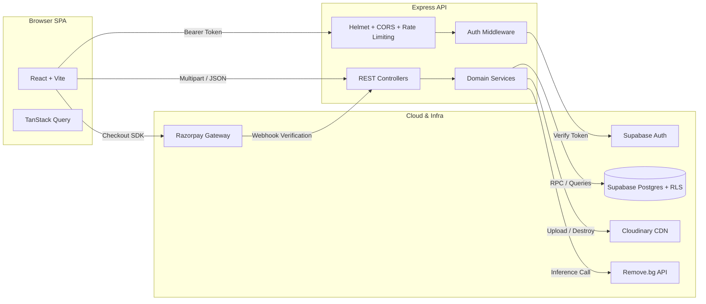

<div align="center">

# PixelMint AI

**Full-stack web application for automated image background removal, featuring tiered subscription billing and usage quota management.**

[](https://react.dev)
[](https://www.typescriptlang.org)
[](https://nodejs.org)
[](https://vitejs.dev)
[](https://supabase.com)
[](https://razorpay.com)
[](https://cloudinary.com)
[](#license)

<br />

[Live Demo](#-live-demo) • [Why PixelMint AI?](#-why-pixelmint-ai) • [Features](#-features) • [Screenshots](#-screenshots) • [Architecture](#-architecture) • [How It Works](#-how-it-works) • [Getting Started](#-getting-started) • [API Overview](#-api-overview) • [Testing](#-testing) • [Known Limitations](#-known-limitations)

</div>

---

## 🌍 Live Demo

| Platform | URL | Description |
| :--- | :--- | :--- |
| **Frontend Application** | https://pixelmint-ai-frontend.vercel.app/ | Interactive Studio & Dashboard |
| **Backend REST API** | https://pixelmint-ai-xo8g.onrender.com | Express REST API |
| **GitHub Repository** | https://github.com/kaifcs/PixelMint_AI | Source Code |

---

## 🌟 Why PixelMint AI?

PixelMint AI is a full-stack SaaS application that removes image backgrounds using the remove.bg API. It provides Supabase-based authentication, an AI image processing pipeline, Razorpay subscription billing, daily usage quotas, and a dashboard for managing processed images.

This project was built to strengthen full-stack development skills using React, TypeScript, Express, Supabase, and cloud services.

---

## ✨ Features

- 🎨 **AI Background Removal** – Upload images via drag-and-drop or clipboard paste (`Ctrl+V` / `Cmd+V`) and remove backgrounds with an interactive before/after comparison slider.
- 🔐 **Authentication** – Sign up, login, and session management via Supabase Auth.
- 📊 **Dashboard** – Track daily usage quota and processed image history.
- 🕘 **Processing History** – View, download, or permanently delete processed image cutouts. Deleting an image also removes its original and processed assets from Cloudinary.
- 💳 **Razorpay Payments** – Upgrade to the Pro tier with signature-verified checkout and idempotent webhook confirmation.
- 👤 **User Profile** – View account details, update password, and check current subscription/quota status.
- 📱 **Responsive Design** – Built with Tailwind CSS and Radix UI primitives.

---

## 📸 Screenshots

### 🏠 Home


### 🏠 Home (Alternative)


### 📊 Dashboard


### 👤 Profile


### 💳 Pricing


### 🔐 Login


### 📝 Signup


### ℹ️ About


### 💬 Contact


### ⭐ Testimonials


### 🕘 History


---

## 💻 Tech Stack

| Layer | Technologies | Description |
| :--- | :--- | :--- |
| **Frontend** | React, Vite, React Router | Single-page application with client-side routing |
| **Styling & UI** | Tailwind CSS, Radix UI, Lucide Icons | Utility-first styling and accessible components |
| **State & Forms** | TanStack Query, React Hook Form, Zod | Data fetching/caching and schema-validated forms |
| **Backend** | Node.js, Express, TypeScript | REST API server with centralized error handling |
| **Security** | Helmet, express-rate-limit | HTTP security headers and per-route rate limiting |
| **Database & Auth** | Supabase PostgreSQL, Supabase Auth | Relational database, Row Level Security, and authentication |
| **Cloud Integration** | Cloudinary SDK, remove.bg API, Razorpay SDK | Media storage, AI background removal, and payment processing |
| **Quality & Tools** | Vitest, ESLint, dotenv | Unit/controller testing, linting, and environment configuration |

---

## 🏗️ Architecture



---

## ⚙️ How It Works

### Authentication

The frontend calls Supabase Auth directly for sign-up/login and attaches the resulting access token as a `Bearer` header on every API request. The backend's `requireAuth` middleware verifies that token against Supabase Auth on each request, then auto-provisions a `FREE`-plan `profiles` row on a user's first authenticated request.

### Authorization

The backend connects to Supabase with the **service-role key**, which bypasses Row Level Security — so authorization for backend-issued queries is enforced explicitly in the service layer (e.g. image lookups and deletes are always scoped by `WHERE id = ? AND user_id = ?`), in addition to RLS policies protecting any direct client-side access to the database.

### Background Removal Pipeline

```
Upload → Cloudinary (original) → remove.bg (background removal) → Cloudinary (processed) → Postgres record (atomic, quota-checked)
```
If any step after the original upload fails, already-created Cloudinary assets are cleaned up before the error is returned. remove.bg calls retry up to twice with backoff on 5xx/429/timeout responses.

### Cloudinary Integration

Original and processed images are uploaded via streaming upload to folder-scoped paths. Deletion (per-image, account-level, and the retention cron) always destroys assets by their stored Cloudinary `public_id` — never by URL.

### Supabase Integration & Database

Four tables: `profiles`, `processed_images`, `payment_orders`, `processed_webhooks`. Row Level Security is enabled on all four, with policies scoped to `auth.uid()`. Operations that must be atomic run as `SECURITY DEFINER` Postgres RPC functions:

- `check_and_record_image_processing_atomic` — checks the daily quota and inserts the processed-image record in a single transaction, preventing race conditions between concurrent uploads.
- `process_payment_webhook_atomic` — idempotently marks a Razorpay order as paid and upgrades the user's plan.
- `delete_user_account_atomic` — cascades deletion of a user's images, payment orders, and profile, returning their Cloudinary public IDs for cleanup.

### Daily Quota System

Usage is computed live (`COUNT(*)` of images created since local midnight), not from a stored counter, and enforced inside the same atomic RPC that records the new image:

- **FREE plan:** 2 images/day
- **PRO plan:** 3 images/day

### Payment System (Razorpay)

`POST /api/create-order` creates a Razorpay order and a `payment_orders` row. Payment confirmation is verified through two independent paths — the client-side checkout callback and the Razorpay webhook — both using `crypto.timingSafeEqual` for constant-time HMAC signature verification, and both funneling into `process_payment_webhook_atomic`. Idempotency is enforced via a `processed_webhooks` table keyed on event ID and payment ID, so duplicate webhook deliveries are safely ignored.

### Image Deletion & Cloudinary Cleanup

`DELETE /api/history/:id` fetches the image record (ownership-verified), attempts to destroy both the original and processed Cloudinary assets by `public_id`, then deletes the database row. A Cloudinary "not found" result is treated as success; any other Cloudinary failure is logged as a warning without blocking the database deletion — the endpoint reports success once the database row is removed.

### 30-Day Image Retention

A daily cron job (production only) deletes `processed_images` rows and their Cloudinary assets after 30 days.

### Security Features

- **Helmet** — applied as the first middleware, setting standard HTTP security headers (CSP, `X-Content-Type-Options`, HSTS, etc.) and removing the `X-Powered-By` header.
- **Rate limiting** — tiered per route: 200 requests/15 min globally, 10/min on background removal, 5/hour on the contact form.
- **Ownership checks** — every user-scoped query (history, deletion) is filtered by the authenticated user's ID at the query level, not just at the route level.
- **Webhook signature verification** — constant-time HMAC comparison for both Razorpay verification paths.
- **Secret redaction** — the structured logger automatically redacts keys like `password`, `token`, and `authorization` from logged metadata.
- **Environment validation** — all required environment variables are validated with Zod at startup; the process fails fast on misconfiguration instead of failing later at request time.

---

## 🗂️ Folder Structure

```
PixelMint_AI/
├── backend/
│   ├── src/
│   │   ├── config/          # Environment variables and cloud SDK clients
│   │   ├── controllers/     # Route handlers (image, payment, user, contact)
│   │   ├── jobs/            # Daily scheduler for asset cleanup
│   │   ├── middlewares/     # Auth verification and rate limiting
│   │   ├── routes/          # Express API router definitions
│   │   ├── services/        # Business logic (removeBg, payment, usage, history)
│   │   └── utils/           # Custom logger and error utilities
│   └── supabase/
│       ├── schema.sql       # PostgreSQL table schemas
│       └── migrations/      # Database policies and functions
├── frontend/
│   ├── src/
│   │   ├── app/             # Query providers, router, and error boundary
│   │   ├── components/      # Navbar, footer, and UI primitives
│   │   ├── features/        # Auth context, upload hooks, and billing logic
│   │   ├── pages/           # Route views (Dashboard, Workspace, Profile, etc.)
│   │   ├── services/        # Typed API client and Supabase singleton
│   │   └── test/            # Vitest unit testing suite
│   ├── vercel.json          # SPA route rewrite rules
│   └── vite.config.ts       # Vite bundler configuration
└── package.json             # Root monorepo workspace scripts
```

Tests are colocated with their source files (`*.test.ts(x)`) in both workspaces rather than kept in a separate directory.

---

## 🚀 Getting Started

### Prerequisites

- **Node.js**: v18+ and **npm** v9+
- **Cloud Accounts**: [Supabase](https://supabase.com), [Cloudinary](https://cloudinary.com), [Razorpay](https://razorpay.com), and [Remove.bg](https://www.remove.bg/api)

### 1. Clone & Install

This repository is an npm workspaces monorepo — a single install at the root sets up both packages.

```bash
git clone https://github.com/kaifcs/PixelMint_AI.git
cd PixelMint_AI

npm install
```

### 2. Configure Environment Variables

Copy the example `.env` files in both workspace directories:

```bash
cp backend/.env.example backend/.env
cp frontend/.env.example frontend/.env
```

### 3. Initialize Database

In your Supabase SQL Editor:
1. Execute `backend/supabase/schema.sql` to initialize core tables.
2. Execute `backend/supabase/migrations/20260727000001_production_security_and_idempotency.sql` to apply RLS policies and RPC functions.

### 4. Run Development Servers

Run the client and server concurrently in two terminal windows, from the repository root:

```bash
# Terminal 1: Backend API Server (http://localhost:3001)
npm run dev:backend

# Terminal 2: Frontend Client (http://localhost:5173)
npm run dev:frontend
```

---

## 🔑 Environment Variables

### Backend (`backend/.env`)

| Category | Variables | Description |
| :--- | :--- | :--- |
| **Server** | `PORT`, `NODE_ENV`, `FRONTEND_URL` | Server port, environment, and allowed CORS origin |
| **Supabase** | `SUPABASE_URL`, `SUPABASE_ANON_KEY`, `SUPABASE_SERVICE_ROLE_KEY` | Database and authentication credentials |
| **Cloudinary** | `CLOUDINARY_CLOUD_NAME`, `CLOUDINARY_API_KEY`, `CLOUDINARY_API_SECRET`, `CLOUDINARY_FOLDER` | Media storage and CDN credentials |
| **Remove.bg** | `REMOVE_BG_API_KEY`, `REMOVE_BG_SIZE` | API key and background removal resolution |
| **Quotas** | `FREE_DAILY_LIMIT`, `PRO_DAILY_LIMIT` | Daily image limits by subscription tier (default 2 / 3) |
| **Razorpay** | `RAZORPAY_KEY_ID`, `RAZORPAY_KEY_SECRET`, `RAZORPAY_WEBHOOK_SECRET`, `RAZORPAY_CURRENCY`, `RAZORPAY_PRO_PLAN_AMOUNT` | Payment gateway and subscription checkout configuration (`RAZORPAY_PRO_PLAN_AMOUNT` is in paise, the smallest INR subunit) |
| **Email** | `BREVO_API_KEY`, `MAIL_FROM_EMAIL`, `MAIL_FROM_NAME`, `CONTACT_RECEIVER_EMAIL` | SMTP settings for outgoing system emails and contact inquiries |

All variables are validated with Zod at process startup; the server refuses to boot if a required variable is missing or malformed.

### Frontend (`frontend/.env`)

| Variable | Default | Description |
| :--- | :--- | :--- |
| `VITE_API_BASE_URL` | `http://localhost:3001` | Absolute base URL of the backend API server |
| `VITE_SUPABASE_URL` | — | Supabase project URL (must match backend) |
| `VITE_SUPABASE_ANON_KEY` | — | Supabase anonymous API key (must match backend) |

---

## 🔌 API Overview

All backend endpoints are prefixed with `/api` and consume/return `application/json` (except image uploads, which are multipart, and the webhook, which reads a raw body).

- `GET /api/health` — Health check endpoint.
- `POST /api/remove-bg` — Process image background removal *(Auth required)*.
- `GET /api/profile` — Retrieve user profile and subscription status *(Auth required)*.
- `GET /api/usage` — Retrieve daily usage and remaining quota *(Auth required)*.
- `GET /api/history` — Retrieve processed image history *(Auth required)*.
- `DELETE /api/history/:id` — Delete a processed image, including its Cloudinary assets *(Auth required, ownership-verified)*.
- `POST /api/create-order` — Create a Razorpay subscription checkout order *(Auth required)*.
- `POST /api/verify-order` — Verify a client-side payment signature and upgrade the plan *(Auth required)*.
- `POST /api/verify-payment` — Razorpay webhook endpoint (signature-verified, idempotent).
- `POST /api/contact` — Send a customer support message (rate-limited).

---

## 🧪 Testing

Both workspaces use Vitest.

- **Backend** — unit and controller-level tests covering: the quota/RPC call contract, Razorpay order-amount passthrough, contact-form validation messages, image-history deletion (ownership checks, Cloudinary success/failure handling, database deletion), and Helmet security headers.
- **Frontend** — component tests for the navigation bar and contact form validation, plus a unit test for the typed API client's error handling.

```bash
npm run test              # both workspaces
npm run test:backend
npm run test:frontend
npm run typecheck         # both workspaces
npm run lint:frontend      # backend has no separate lint script
npm run check              # typecheck + lint + test + build, both workspaces
```

The backend's controllers for background removal (`/api/remove-bg`) and payment order creation/verification are exercised by their underlying service tests but do not yet have dedicated controller-level tests — see [Known Limitations](#-known-limitations).

---

## 📦 Deployment

- **Frontend:** Vercel
- **Backend:** Render
- **Database:** Supabase
- **Media Storage:** Cloudinary
- **Payments:** Razorpay

The backend's daily image-retention cron only runs when `NODE_ENV=production`, and runs in-process via `node-cron` rather than an external scheduler.

---

## ⚠️ Known Limitations

- **No CI pipeline.** `npm run check` (typecheck + lint + test + build) must be run manually before merging; nothing runs it automatically on push or pull request.
- **`react-router-dom` has two open moderate-severity advisories** (open redirect, SSR hydration injection) with no fix available within the current major version — resolving them requires a v6→v7 upgrade.
- **No route-level tests for image processing or payment endpoints.** The underlying services are tested; the `/api/remove-bg` and `/api/create-order` / `/api/verify-order` controllers are not yet covered directly.

---

## 📄 License

This project is open-source and distributed under the terms of the **MIT License**. See the [LICENSE](LICENSE) file for details.

---

## 👨‍💻 Author

**Kaif Khan**

- **GitHub:** https://github.com/kaifcs
- **LinkedIn:** https://www.linkedin.com/in/kaif-khan-2805-2005-cs/

---

<div align="center">
  <p>Built with ❤️ by Kaif Khan</p>
  <p>
    <a href="https://github.com/kaifcs/PixelMint_AI/issues">Report Issue</a> •
    <a href="https://github.com/kaifcs/PixelMint_AI/pulls">Submit Pull Request</a> •
    <a href="#pixelmint-ai">Back to Top ⬆️</a>
  </p>
</div>
